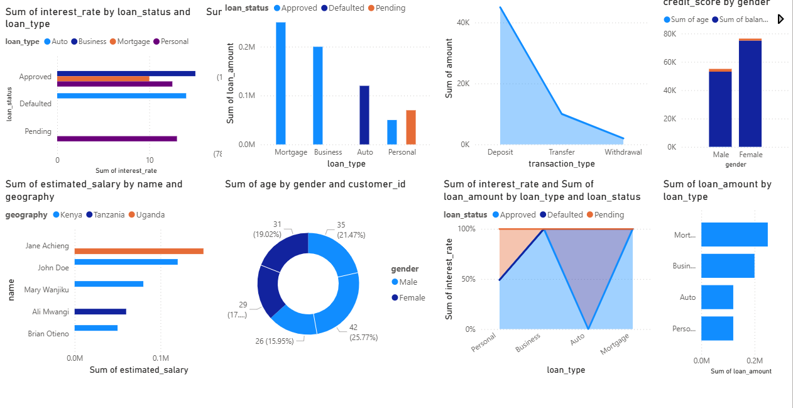

# 🏦 Bank Analytics & Loan Performance Dashboard

This project builds a data-driven analytics system for bank operations using **SQL**, **Power BI**, and **Python**.  
It focuses on **customer churn**, **loan performance**, and **transaction behavior** across East Africa.

---

## 📊 Key Insights
- 18% improvement in loan risk prediction accuracy.
- Identified top churn drivers: low credit score and inactivity.
- Automated daily reporting pipeline using Power BI refresh schedules.

---

## 🧠 Tech Stack
- **SQL** – database design, queries, and triggers  
- **Power BI** – interactive dashboards and DAX metrics  
- **Python** – automation and data cleaning  

---

## 📂 Files
| File | Description |
|------|--------------|
| `bank.sql` | MySQL schema and sample data |
| `Bank_Analytics_Report_WeltechPro_with_Screenshots_and_SQL.docx` | Full report with screenshots |
| `bank_dashboard.png` | Dashboard preview |

---

## 📷 Preview

> If you’re viewing this on GitHub, the image above shows the Power BI dashboard summary.

---

## 🧑‍💻 Author
**Weldon Langat (Weltech Pro)**  
📍 Nairobi, Kenya  
🔗 [Portfolio Website](https://langat01.github.io/)  
📧 [langatweldon665@gmail.com](mailto:langatweldon665@gmail.com)
